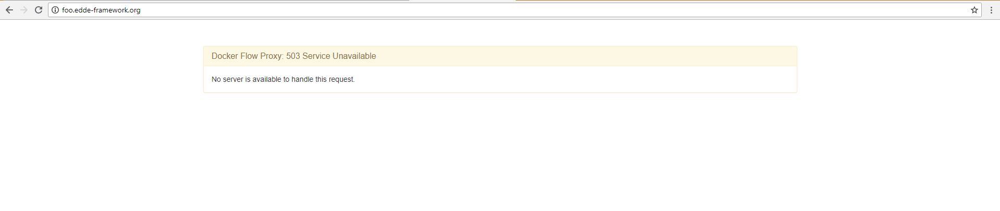

# Proxy {docsify-ignore-all}

If you know nginx or apache with it's virtual hosts, there is another kind of product able to take incoming requests and 
forward them to appropriate containers - in this case [HAProxy](http://www.haproxy.org/). There is some kind of
[dark magic](https://proxy.dockerflow.com/) behind which we'll use.

?> This is probably easiest setup you can use; another option is to setup HAProxy manualy in a good old fashion way. You
don't want to do that.

There is also a [tool](http://proxy-letsencrypt.dockerflow.com/) able to take care about certificates for free (for a limited
number of domains), which means you can run services requiring valid SSL certificates without any pain. Send thanks to the
service of [Let's Encrypt](https://letsencrypt.org/) for this great product! 

!> Be careful about **Let's Encrypt** as you can get certificates only for domains you own, thus it **deos not work** for a local
development! Also there are limit of number of domains you can use, so issue a certificate just for domains you really need to 
be SSL enabled. Remember that certificates free to use, but not **for free**; there is some [cost](https://letsencrypt.org/donate/)
all the times. 

## docker-compose.yml

This is a stack file for Proxy stack with a recommended way of configuration. You can adjust a lot of interesting flags, just have
a look into [documentation](https://proxy.dockerflow.com/config/). 

> Path is based on a storage schema previously discussed. 

!> This is `yaml`. No tabs, use spaces! 

?> **/mnt/storage/common/stack/docker-compose.yml**

```yaml
version: '3.0'
services:
	# main proxy service listening for requests and distributing them to internal stack
    proxy:
        image: dockerflow/docker-flow-proxy
        # important part - these ports will be generally available on your public network
        ports:
            # yes, enclosure is important as the file is sometimes read in wrong way giving
            # strange port numbers
            - "80:80"
            - "443:443"
        # connect proxy on previously created network
        networks:
            - proxy
        # proxy configuration, see
        # https://proxy.dockerflow.com/config/
        environment:
            # service name of swarm listener responsible for sending events for container changes
            - LISTENER_ADDRESS=swarm-listener
            # disabled HTTP/2 is intentional as it still causes some problems with
            # internal services (GitLab); you can try to enable this option but if
            # strange behavior occurs, disable this at first
            - ENABLE_H2=false
            # docker swarm has been enabled, thus this must be set to swarm
            - MODE=swarm
        # this follows schema from storage section; it's necessary to read certificates from
        # the same location where Let's Encrypt service saves them
        volumes:
            - /mnt/storage/common/storage/certs:/certs

	# service listening for container changes to trigger proxy reconfigurations
    swarm-listener:
        image: dockerflow/docker-flow-swarm-listener
        # connect to proxy network to see each other
        networks:
            - proxy
        # this service needs access to docker socket to listen for incoming events; this is mandatory
        volumes:
            - /var/run/docker.sock:/var/run/docker.sock
        # setup of event targets: proxy and let's encrypt service
        environment:
            - DF_NOTIFY_CREATE_SERVICE_URL=http://proxy-le:8080/v1/docker-flow-proxy-letsencrypt/reconfigure
            - DF_NOTIFY_REMOVE_SERVICE_URL=http://proxy:8080/v1/docker-flow-proxy/remove
        # this service must run on manager node
        deploy:
            placement:
                constraints: [node.role == manager]

	# let's encrypt service for optional certificate issuance
    proxy-le:
        image: nib0r/docker-flow-proxy-letsencrypt
        # again, everything must be connected
        networks:
            - proxy
        # name of the proxy service
        environment:
            - DF_PROXY_SERVICE_NAME=proxy
        # this is mandatory: save stuff from let's encrypt or you'll quickly get limit of issued certificates!
        volumes:
            - /mnt/storage/common/storage/certbot:/etc/letsencrypt
        # this service is route external request to internal service port to handle ACME challenge (to confirm
        # that requested domain is yours)
        deploy:
            labels:
                - com.df.notify=true
                - com.df.distribute=true
                - com.df.servicePath=/.well-known/acme-challenge
                - com.df.port=8080

# because we're using network defined previously, we have to mark it as an external
networks:
    proxy:
        external: true
```

## Deployment

Stack deployment is quite simple task:

```bash
# here you have your configuration file
docker-host:~ # cd /mnt/storage/common/stack/

# deploy proxy on Docker Swarm; proxy is the name of a stack
docker-host:/mnt/storage/common/stack/ # docker stack deploy -c docker-compose.yml proxy

# you can see if everything is going good by issuing this command (proxy is stack name, ps is listing services inside the stack)
docker-host:/mnt/storage/common/stack/ # docker stack ps proxy
```
After a while you can open your domain in a browser and you'll see http error you'll probably start to hate:
 

?> Now everything is nice and shiny as Proxy is listening for new containers, so everything is ready to deploy any new
service!

> Now you can continue by deploying [GitLab](/devops/gitlab/index) which is a bit harder to do, but the feeling from success is priceless!

**Previous**: [Storage](/devops/server/storage)
